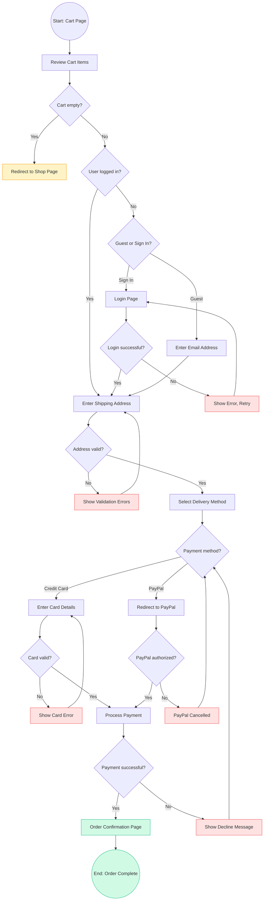
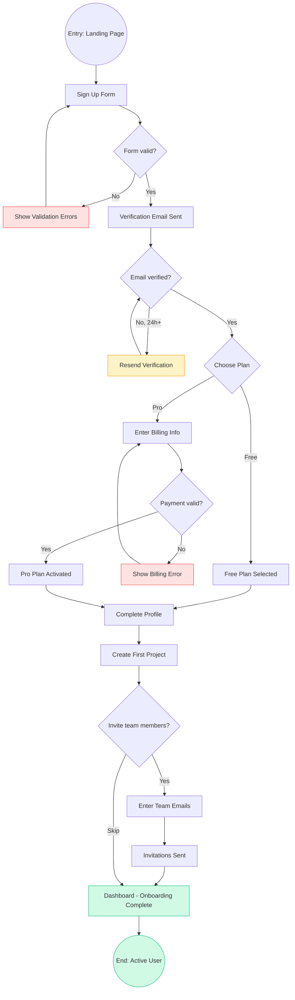

# User Flow Mapping

This skill enables the agent to create detailed user flow diagrams that map every step, decision point, error state, and success path a user encounters while completing a task in a product. The agent produces three types of flows — task flows (single path, no decisions), user flows (multiple paths with decision branches), and wire flows (flows annotated with screen wireframes) — using Mermaid diagram syntax for portability. Each flow includes annotations for conversion metrics, drop-off risk points, and optimization opportunities.

## Workflow

1. **Define the Flow Objective and Scope**: Identify the specific user goal being mapped (e.g., "Complete a purchase," "Reset a password"). Determine the entry points — how the user arrives at the start of the flow (direct link, homepage navigation, email CTA, push notification). Establish the success criteria and the scope boundary so the diagram does not expand indefinitely.

2. **Identify All Steps and Decision Points**: List every screen, action, and system response in sequence. Mark decision points where the user or the system branches (e.g., "Is the user logged in?" or "Did payment succeed?"). Include error states, validation failures, and retry loops. For each step, note whether it is a user action (click, type, swipe) or a system action (redirect, API call, email sent).

3. **Map Happy Path First, Then Edge Paths**: Draw the ideal path from entry to success first. Then layer in alternative paths: what happens if the user is not logged in, if validation fails, if the session times out, if the payment is declined. Each branch should terminate in either a success state, an error recovery path, or an exit point.

4. **Annotate with Metrics and Risk Points**: At each step, note the relevant metric: page view count, click-through rate, form completion rate, drop-off percentage. Flag high-friction steps where users are likely to abandon (multi-field forms, account creation walls, payment pages). Suggest specific optimizations for each risk point.

5. **Generate the Mermaid Diagram**: Produce a clean Mermaid `graph TD` diagram using consistent node shapes: rounded rectangles `()` for pages/screens, diamonds `{}` for decisions, rectangles `[]` for actions, and double-circles `(())` for start/end states. Use descriptive labels and color annotations via `style` directives to highlight error paths in red and success paths in green.

6. **Review and Iterate**: Walk through the diagram with the user to verify completeness. Check that every branch terminates, that no orphan nodes exist, and that the flow accurately reflects the actual product behavior including edge cases.

## Usage

Provide the agent with the user goal, the product context (web app, mobile app, or cross-platform), and any known screens or steps. Optionally include analytics data (drop-off rates, conversion percentages) for the agent to annotate onto the diagram. The agent will produce a Mermaid diagram with annotations.

## Examples

### Example 1: E-Commerce Checkout Flow

**User Request**: "Map the complete checkout flow for our e-commerce site. Users can be logged in or guests. We support credit card and PayPal."

**Agent Response**:

**Metric annotations**:
- Cart → Shipping: ~72% proceed (28% abandon after viewing cart)
- Shipping → Payment: ~85% proceed (address validation is low friction)
- Payment → Confirmation: ~64% proceed (highest drop-off; consider saved payment methods)
- Guest vs Sign In split: ~55% choose guest checkout (reduce friction by keeping guest option prominent)

### Example 2: SaaS Onboarding Flow with Decision Points

**User Request**: "Map the onboarding flow for our project management tool. New users sign up, verify email, choose a plan, create their first project, and invite team members."

**Agent Response**:

**Metric annotations and optimization notes**:
- Sign Up → Email Verified: ~68% verify within 1 hour. Send a reminder at 24 hours. Consider allowing limited access before verification to reduce early churn.
- Plan Selection: ~80% choose Free initially. Offer a 14-day Pro trial without requiring billing info to increase Pro conversion.
- Create First Project: Critical activation step. If the user does not create a project within 48 hours, trigger a guided tutorial email. Target: 60% activation within first session.
- Invite Team: ~35% skip this step. Show the value of collaboration (e.g., "Teams complete projects 3x faster") to increase invite rates.

## Best Practices

- **Always map the happy path before adding branches**: Starting with the ideal path keeps the diagram readable. Layer in error states, edge cases, and alternative paths incrementally.
- **Use consistent node shapes**: Reserve diamonds for decision points, rounded rectangles for screens/pages, and rectangles for user or system actions. This visual grammar makes flows scannable at a glance.
- **Terminate every branch**: Every path in the diagram must end at a defined state — success, error recovery, or explicit exit. Orphan nodes indicate missing logic in the product.
- **Annotate with real data when available**: Drop-off rates, conversion percentages, and session duration at each step transform a flow diagram from a planning artifact into an optimization tool.
- **Keep flows to one user goal per diagram**: Combining "sign up," "purchase," and "manage account" in one diagram creates an unreadable mess. Map each goal separately, then link diagrams at shared entry/exit points.

## Edge Cases

- **Circular flows (retry loops)**: Payment retries, form re-submissions, and re-authentication can create infinite loops in the diagram. Add a maximum retry count annotation (e.g., "Max 3 attempts, then redirect to support") and a terminal exit node for exhausted retries.
- **External system redirects (OAuth, PayPal, 3D Secure)**: When the user leaves the product for third-party authentication, mark the transition explicitly and account for three outcomes: success return, cancellation return, and timeout/no-return. Include a "user never returns" exit node.
- **A/B test variants**: When the flow differs between test groups, create a decision node at the variant split labeled with the test name and variant identifiers, then map both paths to their respective outcomes.
- **Flows that span multiple sessions**: Password reset (email → click link hours later) or email verification may not complete in one session. Mark the session boundary explicitly and indicate what triggers re-entry (email link, push notification, return visit).
- **Offline or degraded states in mobile apps**: If the product works offline, map what happens when connectivity drops mid-flow: queued actions, error messages, and sync-on-reconnect behavior.
