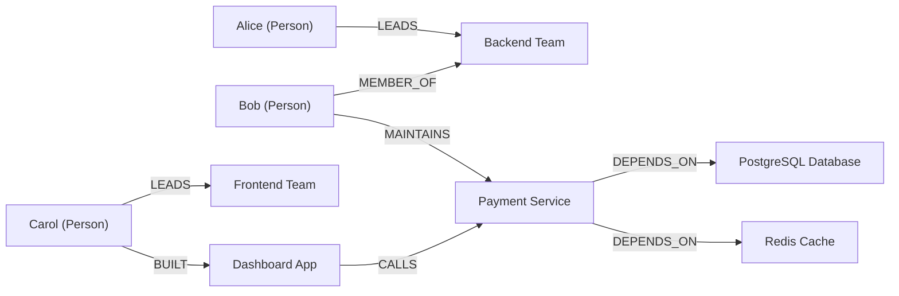

# Knowledge Graph Creation

This skill enables an AI agent to transform unstructured text into a structured knowledge graph. The agent extracts entities (people, organizations, technologies, concepts), identifies the relationships between them, generates formal graph triples (subject-predicate-object), and outputs the graph in both a queryable format (Cypher for Neo4j, JSON-LD) and a visual diagram (Mermaid). Knowledge graphs are valuable for understanding complex domains, powering semantic search, detecting implicit connections, and building recommendation systems.

## Workflow

1. **Analyze the Source Material:** Read the input text and determine its domain, scope, and complexity. Identify the types of entities likely present (people, organizations, locations, technical concepts, events, etc.) and the granularity appropriate for the graph. A technical architecture document requires fine-grained component-level entities, while a news article may need coarser actor-level entities.

2. **Extract Entities:** Identify all named entities and significant concepts in the text. For each entity, record its canonical name, type (person, organization, technology, concept, event, location), and any notable attributes mentioned (e.g., founding date, version number, role). Deduplicate entities that appear under different names or abbreviations.

3. **Map Relationships:** For every pair of entities that interact in the text, identify the relationship between them. Express each relationship as a directed triple: (Subject) -[PREDICATE]-> (Object). Choose predicates from a consistent vocabulary (e.g., WORKS_AT, DEPENDS_ON, CREATED_BY, PART_OF, COMPETES_WITH). Record the source sentence for traceability.

4. **Generate Graph Triples and Schema:** Formalize the extracted data into a structured format. Output triples in one or more of: Cypher CREATE statements for Neo4j, JSON-LD for web interoperability, or a simple CSV of (subject, predicate, object) rows. Define a lightweight schema listing entity types and valid relationship types.

5. **Visualize the Graph:** Produce a human-readable visualization of the graph. Use Mermaid syntax for embedding in Markdown, or describe the layout for tools like D3.js, Gephi, or Neo4j Browser. Highlight central nodes and key relationship clusters.

6. **Validate and Refine:** Review the graph for completeness and accuracy. Check for orphan nodes (entities with no relationships), missing relationships implied by the text, and overly generic predicates that could be made more specific. Invite the user to confirm, correct, or request expansion of particular subgraphs.

## Usage

Provide the agent with a text passage, document, or set of documents. Optionally specify the desired output format (Cypher, JSON-LD, Mermaid), the entity types of interest, or the maximum graph size.

```
Build a knowledge graph from the following text about our microservices architecture.
Output Cypher queries for Neo4j and a Mermaid diagram.

Text: "The API Gateway routes requests to the Auth Service and the Order Service.
The Order Service depends on the Inventory Service and the Payment Service.
The Payment Service integrates with Stripe and PayPal. All services publish
events to the Event Bus, which the Analytics Service consumes."
```

## Examples

### Example 1: Knowledge Graph from a Technical Document

**User Request:**
> Build a knowledge graph from this text:
> "Kubernetes orchestrates containerized applications across clusters. A Pod is the smallest deployable unit in Kubernetes and contains one or more containers. Pods are managed by Deployments, which ensure the desired number of replicas. Services expose Pods to network traffic. Ingress routes external HTTP traffic to Services. etcd stores all cluster state data and is accessed by the API Server. kubectl is the CLI tool that communicates with the API Server."

**Extracted Entities:**

| Entity | Type | Attributes |
|---|---|---|
| Kubernetes | Technology | Container orchestration platform |
| Pod | Concept | Smallest deployable unit |
| Container | Concept | Runtime unit inside a Pod |
| Deployment | Concept | Manages Pod replicas |
| Service | Concept | Network exposure layer |
| Ingress | Concept | External HTTP routing |
| etcd | Technology | Distributed key-value store |
| API Server | Component | Central management interface |
| kubectl | Tool | CLI client |

**Relationships and Triples:**

| Subject | Predicate | Object |
|---|---|---|
| Kubernetes | ORCHESTRATES | Pod |
| Pod | CONTAINS | Container |
| Deployment | MANAGES | Pod |
| Service | EXPOSES | Pod |
| Ingress | ROUTES_TO | Service |
| etcd | STORES_STATE_FOR | Kubernetes |
| API Server | READS_FROM | etcd |
| kubectl | COMMUNICATES_WITH | API Server |

**Cypher Queries:**
```cypher
CREATE (k:Technology {name: 'Kubernetes', description: 'Container orchestration platform'})
CREATE (pod:Concept {name: 'Pod', description: 'Smallest deployable unit'})
CREATE (container:Concept {name: 'Container', description: 'Runtime unit'})
CREATE (deploy:Concept {name: 'Deployment', description: 'Manages Pod replicas'})
CREATE (svc:Concept {name: 'Service', description: 'Network exposure layer'})
CREATE (ing:Concept {name: 'Ingress', description: 'External HTTP routing'})
CREATE (etcd:Technology {name: 'etcd', description: 'Distributed key-value store'})
CREATE (api:Component {name: 'API Server', description: 'Central management interface'})
CREATE (ctl:Tool {name: 'kubectl', description: 'CLI client'})

CREATE (k)-[:ORCHESTRATES]->(pod)
CREATE (pod)-[:CONTAINS]->(container)
CREATE (deploy)-[:MANAGES]->(pod)
CREATE (svc)-[:EXPOSES]->(pod)
CREATE (ing)-[:ROUTES_TO]->(svc)
CREATE (etcd)-[:STORES_STATE_FOR]->(k)
CREATE (api)-[:READS_FROM]->(etcd)
CREATE (ctl)-[:COMMUNICATES_WITH]->(api)
```

---

### Example 2: Mermaid Visualization of a Knowledge Graph

**User Request:**
> Create a knowledge graph with a Mermaid diagram from this text:
> "Alice leads the Backend Team. Bob is on the Backend Team and maintains the Payment Service. The Payment Service depends on the PostgreSQL Database and the Redis Cache. Carol leads the Frontend Team and built the Dashboard App, which calls the Payment Service API."

**Extracted Entities and Relationships:**

| Subject | Predicate | Object |
|---|---|---|
| Alice | LEADS | Backend Team |
| Bob | MEMBER_OF | Backend Team |
| Bob | MAINTAINS | Payment Service |
| Payment Service | DEPENDS_ON | PostgreSQL Database |
| Payment Service | DEPENDS_ON | Redis Cache |
| Carol | LEADS | Frontend Team |
| Carol | BUILT | Dashboard App |
| Dashboard App | CALLS | Payment Service |

**Mermaid Diagram:**


This visualization immediately reveals that the Payment Service is a central node with high connectivity — it is maintained by Bob, depended on by the Dashboard App, and itself depends on two data stores. This makes it a key risk area for both the Backend and Frontend teams.

## Best Practices

- **Use a consistent predicate vocabulary.** Define a controlled set of relationship types (DEPENDS_ON, CREATED_BY, PART_OF, etc.) before building the graph. This enables meaningful queries and prevents synonym fragmentation.
- **Normalize entity names.** Resolve aliases, abbreviations, and co-references to a single canonical name. "JS," "JavaScript," and "ECMAScript" should map to one node unless the distinction matters.
- **Include entity attributes.** Bare nodes with only a name are less useful than nodes with type, description, and metadata attributes. Richer nodes enable more powerful queries.
- **Prioritize relationship directionality.** Always model relationships as directed edges with a clear subject and object. Bidirectional relationships should be represented as two directed edges if the semantics differ in each direction.
- **Keep the graph focused.** Not every noun needs to be an entity. Focus on entities that are relevant to the user's purpose and exclude generic terms that add noise without insight.

## Edge Cases

- **Ambiguous entity references:** When the text contains pronouns or vague references ("it," "the system"), resolve them to specific entities based on context. If resolution is uncertain, note the ambiguity and ask the user to clarify.
- **Implicit relationships:** Some relationships are implied but not explicitly stated (e.g., "Alice and Bob work at Acme Corp" implies both WORKS_AT relationships). Extract these, but flag them as inferred rather than directly stated.
- **Very large source texts:** For documents exceeding a few thousand words, process the text in chunks and merge entity graphs across chunks, deduplicating as you go. Warn the user if the resulting graph exceeds a practical visualization size (roughly 50+ nodes).
- **Contradictory information:** If the source text contains conflicting statements about relationships (e.g., "Service A depends on Service B" in one paragraph and "Service A has no external dependencies" in another), include both and flag the contradiction.
- **Domain-specific terminology:** In specialized domains (medical, legal, financial), entity types and relationship predicates should reflect domain ontologies (e.g., SNOMED CT for medical, FIBO for financial) when the user requires interoperability with existing knowledge bases.
